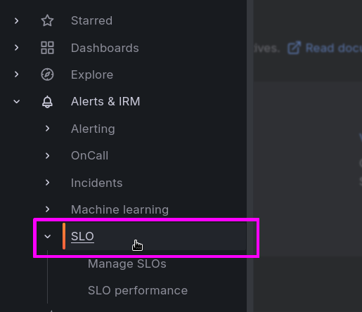
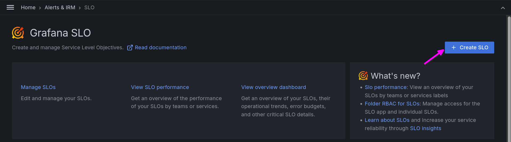

# SLO Workshop Breakout 2 - SLO Creation in Grafana Cloud

## Introduction
Grafana SLO makes it easy for teams to create, manage, and scale SLOs, SLO dashboards, and error budget alerts, all within Grafana Cloud.

**Problem Statement:**
It’s hard to find an organization today that doesn’t struggle with alerting. Having too many alerts can make it difficult to tell which ones are actually indicating a customer problem. Alert fatigue can also contribute to engineer burnout and increase attrition.

We also see managers and developers struggling to decide on whether to fix bugs or work on that new feature. This can lead to a bad customer experience and it is also why we’re seeing most teams shift away from traditional alerting, towards being SLO driven, where teams get direct visibility into the services that most affect their customer health, and know that if someone is being woken up in the middle of the night, it’s probably for a good reason.

Achieving mature SLO adoption is deceptively difficult though and can require both having the right tools as well as building a collaborative culture around them. 

**Grafana SLO Value Proposition:**
Grafana SLO simplifies SLO management with a Guided UI and Prometheus-less queries, so users can set them up without needing to know PromQL. It auto-generates dashboards and multi-window, multi-burn alerts and supports as-code provisioning by API and Terraform.
Grafana SLOs can tell you that not only tell us that something important is happening, but why. 

**Why would  a user choose to use this feature?**
1. **Beginner-friendly** - Grafana SLO supports first-time users while creating meaningful SLIs/SLOs with a guided UI that then abstracts managing the backend queries as SLOs continue to be refined.
2. **Supervise the state of your services’ health** - Gain service state visibility through overview visualizations and automated reporting and alerting capabilities.
3. **Scale SLOs as code** - Avoid the daunting task of building hundreds of SLOs completely by UI, Grafana SLO supports provisioning as-code via an API or Terraform.

Follow the below steps to generate SLOs for your first SLO using [Grafana SLO](https://grafana.com/docs/grafana-cloud/alerting-and-irm/slo/).

## Part 1 - Initializing Grafana SLO
```Step 1:``` Login to Grafana Cloud

```Step 2:``` On the left-side menu, expand out 'Alerts & IRM' and select 'SLO'



This should take you to the SLO application within Grafana.

```Step 3:``` Click 'Initialize Grafana SLO' 

*note: If you do not see this button your Grafana SLO is already initialized, and you can advance to the next step.*


## Part 2 - Creating and Configuring SLOs with Grafana SLO
In this section you will walk through the process of creating your SLOs.

```Step 1:``` click 'Create SLO'



### 2.1 - Define SLI
We will start by defining your time window. The default time window is set to 28 days, which captures the same number of weekends regardless of the day of the week. This is a better way to account for traffic variation over weekends than a 30-day SLO. In this lab we will leave the time window to the default.

Once we have input our time window, it is time to choose a metric-based query type. In Grafana SLO, there are two types of metric-based queries: Ratio and Advanced.

- *Ratio queries* are the simplest type of metric-based query. They consist of two metrics: a success metric and a total metric. The success metric is the number of events that meet a certain condition, such as HTTP requests without errors. The total metric is the total number of events. The ratio query then calculates the percentage of successful events as a number between 0 and 1.

- *Advanced queries* are more complex than ratio queries. They can use a variety of functions and operators to calculate the SLI. For example, an advanced query could calculate the mean time to first byte (TTFB) for HTTP requests.

The main difference between ratio and advanced queries is the complexity of the calculation. Ratio queries are simpler and easier to understand, but they may not be as flexible as advanced queries. Advanced queries can be used to calculate more complex SLIs, but they can be more difficult to understand and debug.

```Step 2:``` Under the section Start querying select 'Ratio'

```Step 3:``` Set 'Success Metric' to
```
traces_spanmetrics_calls_total{status_code!="STATUS_CODE_ERROR", service=~"currencyservice|checkoutservice|shippingservice|paymentservice|cartservice"}
``` 
This metric accounts for all HTTP calls without errors.

```Step 4:``` Set 'Total Metric' to 
```
traces_spanmetrics_calls_total{service=~"currencyservice|checkoutservice|shippingservice|paymentservice|cartservice"}
```
This metric accounts for all HTTP calls for the various services related to the user purchasing products off of our ecommerce site, regardless of errors.

```Step 5:``` Set 'Grouping' to
```
service
```
This label will be used to distinguish between different services. This is a big differentiator of Grafana SLO, the capability to provide a group by label in our SLI definition, which will give us deep insight into which parts of my application are contributing the most to our error burn rate.

```Step 6:``` Click 'Run queries'
You should see a auto-generated SLI query and its visual representation.


```Step 7:``` Click 'Set target and error budget'

### 2.2 - Set target and error budget
```Step 8:``` Set the desired SLO target as 95%, resulting in an error budget of 5%


```Step 9:``` Click 'Add name and description'

### 2.3 - Add name and description
```Step 10:``` Set SLO name to
```
Ecommerce-Critical-Services-Success-Rate
```
```Step 11:``` Set SLO description to
```
This Service Level Objective (SLO) monitors the proportion of successful HTTP calls to critical services within our application, including the payment, checkout, and cart services. 
```


```Step 12:``` Click 'Add SLO alert rules'

### 2.4 - Add SLO alert rules

```Step 13:``` Check the ‘Add SLO alert rules’ checkbox


This auto generates 2 types of alerts based upon the configured SLO:
- *Fast-burn* - When we are depleting through our error budget extremely fast as compared to our targets set in step 3b. This would typically mean relevant teams would get notified in an expedient manner and they’d need to focus on increasing the reliability of the service.
- *Slow-burn* - When we are depleting through our budget slowly. It still requires attention but we don’t need to deprioritize everything else and work on a fix.

*Note: you can configure these alerts to be routed to various [contact points](https://grafana.com/docs/grafana/latest/alerting/alerting-rules/manage-contact-points/configure-integrations/). For fast-burn alert rules, we suggest using a paging service, such as Grafana OnCall or Pagerduty. For slow-burn alert rules, we suggest opening a ticket in Jira, ServiceNow, Github, or another ticketing system.*

```Step 14:``` Click 'Review SLO'

### 2.5 - Review SLO
```Step 15:``` Once you have ensured everything is accurately configured. Click 'Save and view all SLOs'


## Part 3 - Monitoring SLO Performance and Error Budget Depletion
Once the newly configured SLO is in place, give it around 2-4 minutes. This pause allows the Grafana dashboard to start populating with data specific to the SLO, reflecting in most, if not all, panels.

```Step 1:``` refresh page and then click 'View dashboard'


On the left we have quick visual queues to let us know the current status of our alerts. We also get an overview of the time window and SLO object value, as well as our current SLI, remaining error budget and current burn rate.

```Step 2:``` change the time window to be 'Last 5 minutes'


Based upon the http_target selection in the top left, you would see different SLI, error budget and corresponding burn rate values for each endpoint or the aggregate (all).


In the snapshot below, /account endpoint is not adhering to the target SLO of 95% at the moment and thereby depleting through the error budget faster than we’d like. This information is appropriately color coded in these dashboards to help interpret the current state quickly.


**That’s the end of this breakout. Thank you for participating.**
