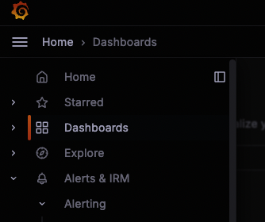
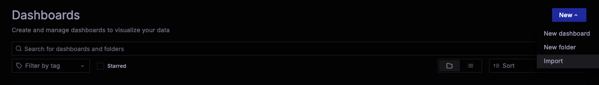

# Breakout 2 - SLO Creation using Sloth

In this lab, we will go through the following steps:

1. Define Service Level Objectives (SLOs) in YAML files (Sloths configuration file)
2. Generate recording Rules and alerts for Mimir using the [Sloth](https://sloth.dev/) tool
3. Import the recording rules and alerts into Mimir/Prometheus using [Mimirtool](https://grafana.com/docs/mimir/latest/manage/tools/mimirtool/)
4. Track SLOs using Grafana dashboards to ensure our services are meeting the defined objectives

## Prerequisites

- Familiarity with Linux shell and editors like vim or Nano/Pico. The workshop involves editing files in the WebTerminal using `pico` or `vim`.
- Access to the WebShell via the link in your workshop email (username and password provided).

## Setting the Scene
We've instrumented our critical business application, Mythical Beasts, and now aim to use SLOs to guide decisions on whether to prioritize innovation and new feature development or focus on service stability and performance optimization.

Our application is already in early access, with performance, errors, and load being monitored on the Mythical Inc., Top Level Endpoints RED (MLT) dashboard in Grafana.

Our task is to establish Service Level Objectives (SLOs) for the `/login` endpoint, utilizing the `traces_spanmetrics_calls_total` prometheus metric from the [tempo metric generator](https://grafana.com/docs/tempo/latest/) as our Service Level Indicator metric.

## Lab Steps
### Part 1 - Login into the Webterminal

1. Navigate to the Webterminal URL provided to you. When prompted, input your provided username and password. 
2. Once you are successfully logged in, you can view your home directory by running the command `ls`. Your directory already includes:
   - A `sloth` directory containing its executable and an example file. This was created by copying the relevant files from the official [Sloth GitHub repo](https://github.com/slok/sloth.git), downloading the Sloth executable from [here](https://github.com/slok/sloth/releases/tag/v0.11.0), performing a `chmod +x` on the executable file, and renaming the file to `sloth`.
   - A `mimirtool` binary, downloaded from the Assets section of [Mimir's latest release page](https://github.com/grafana/mimir/releases). Mimir documentation can be found [here](https://grafana.com/docs/mimir/latest/operators-guide/tools/mimirtool/).
   - Other files that will be used during the lab.

### Part 2 - Create SLO files based on existing examples from Sloth

1. First, we are going to modify [sloth's getting started template](https://sloth.dev/examples/default/getting-started/). In the WebShell, run:

   ```bash
   cp ./sloth/examples/getting-started.yml ./sloth/examples/mythical.yml
   pico ./sloth/examples/mythical.yml
   ```

2. In this source file, we need to edit many of the definitions.

   a. **version**: `prometheus/v1` -> We will keep this definition as our application metrics are Prometheus-based.

   b. **service**: `myservice` -> Let's change this value to our service name, `mythical-beasts`

   c. **labels**: `owner`, `repo`, and `tier`.  These labels are added to our recording rules.
      - For now, let's delete the `repo` line.
      - Keep the line with `tier` as-is (as mythical beasts is a tier 2 application).
      - Change the value of `owner` from `myteam` to your first initial and last name.
      - Add a new label-value pair called `type: "slo"`(horizontally indented the same as your existing labels).  This will allow us to find our SLO definitions in production more easily in the Grafana Alerting UI.

   d. Next are the **slos**.  Like with this example, we are going to stick with just one SLO - a request/error rate SLO - but our SLO target is going to be much lower.
      - Change the comment from `We allow failing (5xx and 429) 1 request every 1000 requests (99.9%).` to: `We allow failing (5xx and 429) 1 of every 20 requests (95%).`.
      - Since this SLO will be for the login endpoint only, change the name from "requests-availability" to `login-availability`
      - Change the objective from 99.9 to `95.0`.
      - Keep the **description** as-is.  This description does not generate any output.

3. We now get to the two **sli** values driving the SLO:

    Sloth is a ratio-based SLO tool, and we need to define two SLIs: (1) our error count and (2) our total count. The ratio of these two SLIs is our error or failure rate.
    
    We must edit the formula `sum(rate(http_request_duration_seconds_count{job="myservice",code=~"(5..|429)"}[{{.window}}]))` to match how our application is capturing error percentages today. We have been tasked to start with the `/login` http_target.
   
    a. In the WebShell copy and paste this formula into the **error_query** field:
    
        ```bash
        sum by (http_target)(increase(traces_spanmetrics_calls_total{service_name="mythical-server",http_target=~"/login", status_code="STATUS_CODE_ERROR"}[{{.window}}]))
        ```
    
   - If you are curious, we leave the `sum by http_target` in the formula because we have multiple pods supporting the application, and so those metrics need to be aggregated.
   - We also use a `[{{.window}}]` notation for the time range because it is a variable in Sloth. Sloth fills this value in for each of the recording rules it creates for each of our time windows: 5m, 30m, 1h, 2h, 6h, 1d, 3d, 30d.
  
    b. Copy and paste this formula into the **total_query** field. Notice the only difference between this formula and the error_query formula is the status_code NOT(!) empty:
    
        ```bash
        sum by (http_target)(increase(traces_spanmetrics_calls_total{service_name="mythical-server",http_target=~"/login", status_code!=""}[{{.window}}]))
        ```

4. Now that our SLIs are defined, we need two minor edits to our alerting section:

    a. Change the alerting **name** to `MythicalBeastsHighErrorRate-login`.
    
    b. For alerting labels, keep the existing `category: "availability"` key-value pair. Add a new label-value pair called `type: "slo"` (horizontally in line with your existing label). This will allow us to find our SLO definitions in production more easily in the Grafana Alerting UI.
    
    c. Change the alert annotations **summary** from `"High error rate on 'myservice' requests responses"` to `"High error rate on Mythical Beast login request responses"`.
    
    d. Delete the last 8 lines (a 4-line `page_alert` block and a 4-line `ticket_alert` block). This allows you to set custom tags for "page" versus "ticket" types of alerts as mentioned in the presentation. You will see that page versus ticket alert types are automatically defined and appropriately tagged with the label, `sloth_severity`, without adding extra labels to our definition.

5. Finally, save the code you’ve just added by typing **Ctrl-O** and the pressing **enter**.

6. Then quit Pico with **Ctrl-X**. If you don’t save, you’ll be first asked if you want to save the file if you just hit **Ctrl-X**.

7. We are now ready to run Sloth.  From command line, run the following command:
    ```bash
    ./sloth/sloth generate -i ./sloth/examples/mythical.yml > ./mythical-beasts-SLO-rules.yml
    ```
If it fails to feel free to cross check it with the completed example [here](./supplementary_materials/complete_slo.yml).

Assuming you have no errors, your output file (`mythical-beasts-SLO-rules.yml`) will look similar to the structure (but not content) found in Sloth's online documentation [here](https://sloth.dev/examples/default/getting-started/) (click on the "Generated" tab).

We can now import your SLO rules into Grafana Cloud!  But first, we need to download an API key for data transmission.

### Import SLO Alerts and Recording rules into Grafana Cloud

We have supplied credentials for you so you can import the SLO alerts and recording rules into Grafana Cloud. You can also use mimirtool to upload this to your self hosted prometheus instance. 

1. Run the `get-credentials.sh` script:
      ```bash
      ./get-credentials.sh
      ```
      This will give you three fields with associated values:
      * `slug` - The slugname
      * `tenantId` - The metrics tenant ID for Grafana Cloud
      * `apiKey` - The API key to use with Grafana Cloud

2. Using your slo rules file, your mimirtool executable, slug name, tenant ID and api key, import your SLO recording rules and alerts:
    ```bash
    ./mimirtool rules load ./mythical-beasts-SLO-rules.yml --address=<slug> --id=<tenantId> --key=<apiKey>
    ```
    Be sure to use the full value for each.

 3. Assuming there were no errors, navigate to to your Grafana UI `https://<username>.grafana.net`. Then login with the same username and password you used to access the webterminal. Once you are authenticated expand out the lefthand menu bar. Find the section labeled **Alerts & IRM**. Expand that section out, then expand out the **Alerting** section and  click on **Alert rules**.

    

    a. You should see your recording rules as well as your alerts listed.  To see your recording rules, use the "Search by label" capability by typing in `label:sloth_slo=login-availability`.  Results similar to the picture below should appear. (You may need to click the **>** next to each rule group to view all the rules.) You have two sets of recording rules:
    - `sloth-slo-meta-recordings-mythical-beasts-login-availability` - the meta recording rules
    - `sloth-slo-sli-recordings-mythical-beasts-login-availability` - the SLI/SLO recording rules

    While the meta recording rules are fairly simplistic, expand the first SLI/SLO recording rule by clicking on the **>** next to it.  As you can see in the picture below, Sloth created this complex formula on your behalf.

    

    b. As for alerts generated, two multi-time window, multi-burn rate alerts are generated.  To see your alert rules, use the "Search by label" capability by typing in ```label:category=availability```.  Results similar to the picture further below should appear. Click the **>** next to the rule group to see the rules, and expand each rule to see its detail.

    One rule is for slow burns over longer periods of time, which has a tag of ```sloth_severity=ticket```. The second alert is for higher burn rates over shorter periods of time and has a tag of ```sloth_severity=page```.  These tags can be used to route your SLO alerts to say, Slack, for an SRE to investigate immediately if you are experiencing high burn rates, and then route your slow burn rate alerts to your ticketing system for scheduled analysis.

    

 ### Import an SLO dashboard into Grafana Cloud

 If we'd like to visualize this data over time and see how we are doing against our objectives, we can import a dashboard into Grafana Cloud.

Steps to Import:

1. Expand out the lefthand menu bar and navigate to **Dashboards**. 



2. Then on the righthand side of the screen, hit the drop down on the blue `New` button and select **+ Import**.



3. In the 'Find and import dashboards for common applications at grafana.com/dashboards field' type in `14348` and then click *Load*.  For the `prometheus` data source, select `grafanacloud-<username>-prom` where `<username>` is the username for your instance, and then select "Import".

 If you were to add more SLOs for our application, the dashboard would look similar to this below.

    

__Note__: These are the out-of-box dashboards provided by Sloth [here](https://sloth.dev/introduction/dashboards/). There are two details to be aware of:
* You will see no burn rates in the top graphs if you do not enter in a value.  If you enter a burn rate of `0.01` into the field `Min Burning Rate` like is shown in the picture above, you will see all of the burn rates for your SLOs.

* You will likely see a graph that says `No Data` in one of the graphs like this (in red):

If you click on the top of the No Data panel and then click `Edit`, you will see a complicated formula that uses a time range of `32d`.  In the picture below, I have changed that SLO window to `31d`, and now you see that the data is populating correctly for this panel.  After editing your SLO window to *31d*, click on `Apply` in the top right to apply your change.


3. An overview dashboard is also available. Once again expand out the lefthand menu bar and navigate to **Dashboards**. 


4. Then on the righthand side of the screen, hit the drop down on the blue `New` button and select **+ Import**.


5. In the Find and import dashboards for common applications at grafana.com/dashboards field type in `14643` and then click **Load**. For the `prometheus` data source, select `grafanacloud-<username>-prom` where `<username>` is the username for your instance, and then select "Import".

An example representation is below where a second SLO has been added for effect.  The reason I find the overview valuable is that it visualizes a state timeline on your behalf for all of your services. So, you can see exactly when your burn rates were running hot.  One thing that can be adjusted on this dashboard is that while we have a datasource variable dropdown at the top of the dashboard, that variable is not propagated to its panels.  This is an easy fix, but not something that we will cover in this workshop.


#### ********************************************************************************
## **[END OF HANDS-ON PORTION OF THE WORKSHOP]**
#### ********************************************************************************

#### Optional Activities for Early Finishers:
- **Explore More:** If you're interested in learning more about the application used in this lab, [click here](./supplementary_materials/setting_the_scene.md) for additional information.

- **Extra Credit Challenge:** For students who like to work ahead and have already completed the current lab tasks, consider testing your skills with Sloth configuration files. You can create additional Service Level Objectives (SLOs) for other application endpoints such as `/account`, `/health`, `/cart`, `/fastcache`, and `/payment`. Don't worry if you don't complete this during class time. You can refer to an example configuration file [here](./supplementary_materials/examples/slo-config-availability-only.yml). For further instructions, [click here](./supplementary_materials/continuation_of_lab.md).

- Click here to see an example definitions of SLOs for [availability](./supplementary_materials/slo_example_templates/slo-config-availability-only.yml) and here for [latency-based SLOs](./supplementary_materials/slo_example_templates/slo-config-latency.yml).
