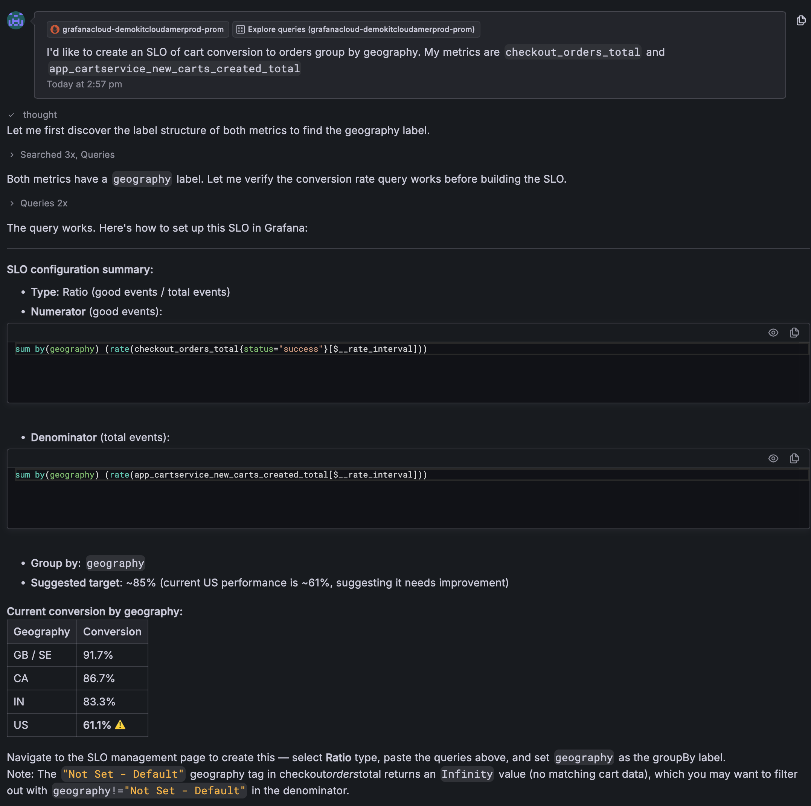
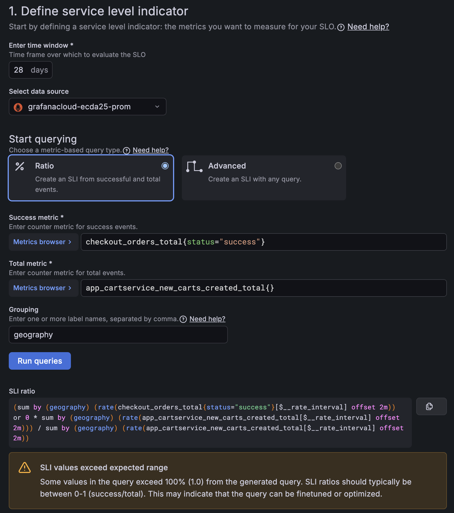
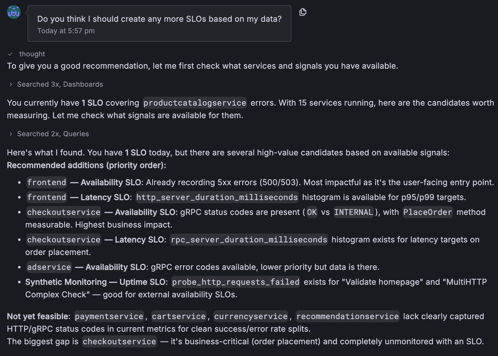
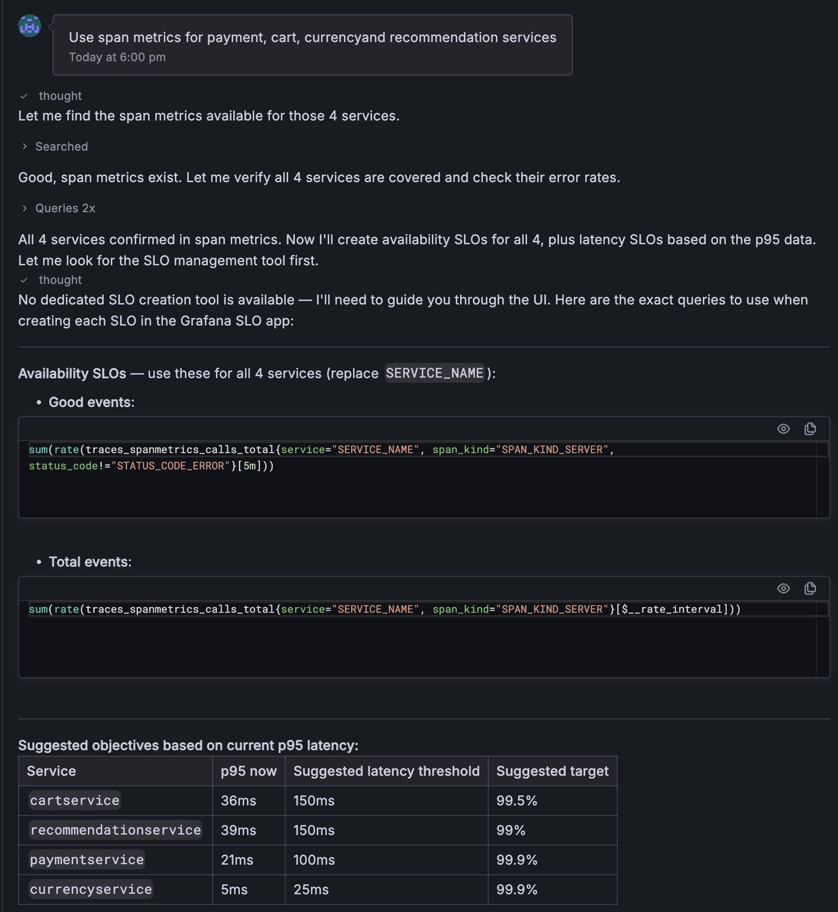

# SLO Workshop Breakout 3 - Using Grafana Assistant with SLOs

**Why use Assistant?**

Part 3 of lab 2 shows us how to view and monitor SLOs. However, we can also use our friendly neighbourhood Assistant to help here too. Assistant can look at the SLOs and provide a clear breakdown of what each SLO is, how it's performed, group the, explain why they are in their current state and so much more. The options are limited by your imagination. 

In this breakout, we are going to use Assistant to understand our new SLO and then create a new one.

It's worth noting that today there is not a specific Tool in Assistant to help us here, but with its general knowledge of Grafana it can provide fantastic guidance still. The specific SLO Tool is coming soon.

## Part 1 - Understanding your SLOs with Assistant
Go to Grafana, open Assistant and ask it something like:

`What are my SLOs? Give me a breakdown of each SLO, it's remaining error budget and general status`

Note, Assistant is powered by LLMs, it is not deterministic so everyone will get slightly different formatted responses.

### Part 2 - Creating an SLO with Assistant
As mentioned above, Assistant doesn't have a Tool to help you directly create an SLO within the Assistant experience, but it is aware of SLOs, best practices and the SLO app. 
This means we can use Assistant to help guide us. Let's say I want to create a new SLO based on cart conversion of orders, I know I have my two metrics `checkout_orders_total` and `app_cartservice_new_carts_created_total`. Let's ask Assistant to help guide us to create this SLO.
We can ask Assistant something like:

`I'd like to create an SLO of cart conversion to orders group by geography. My metrics are checkout_orders_total and app_cartservice_new_carts_created_total`

You should get a warning about `geography` labels having a value of `Not Set - Default`. This is totally fine and expected, the reason we use this example here is to show how you can follow up with Assistant. Sometimes it will fix the queries in the numerator and denominator to filter out `Not Set - Default` - sometimes it doesn't.

If yours doesn't, just copy in the queries as is to the SLO UI and it will say something like `Some values in the query exceed 100% (1.0) from the generated query. SLI ratios should typically be between 0-1 (success/total). This may indicate that the query can be finetuned or optimized.`

Copy that error into the Assistant chat and ask it to help you! That is why it's there, to help you. It will then recommend filtering out that label value and all will work.

### Part 3 - Using Assistant to recommend SLOs
Let's now use Assistant to help us understand our gap in SLOs. Ask `Do you think I should create any more SLOs based on my data?`

Here is an example chat where Assistant is recommending different SLOs based on exploring my data:

Based on its last comment around missing http/grpc metrics, I prompted it to use span metrics instead and with that bit of extra context it can recommend SLOs for those remaining services

**That’s the end of this breakout. Thank you for participating.**
