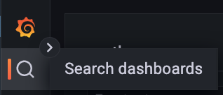
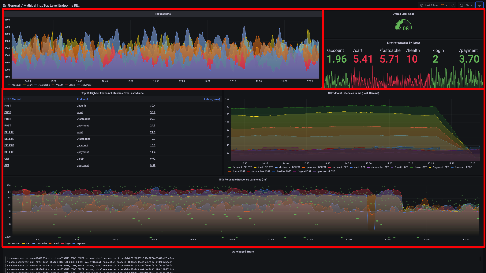
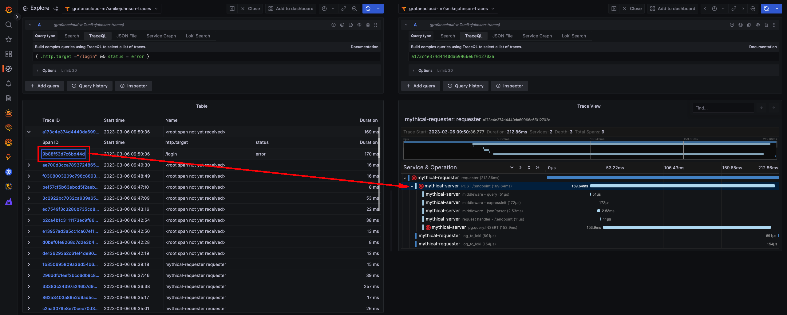
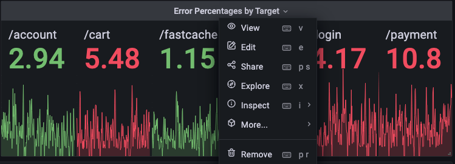
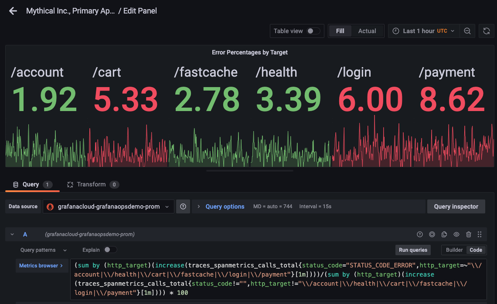
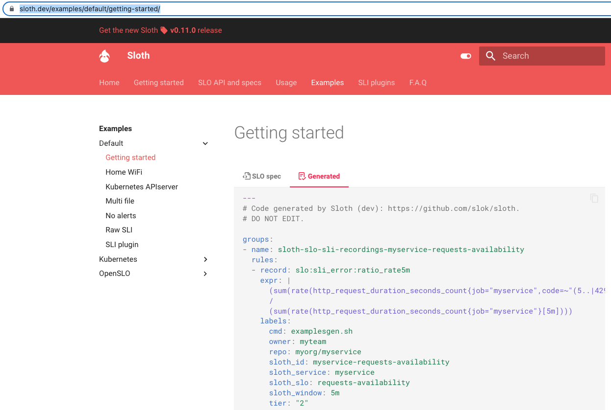
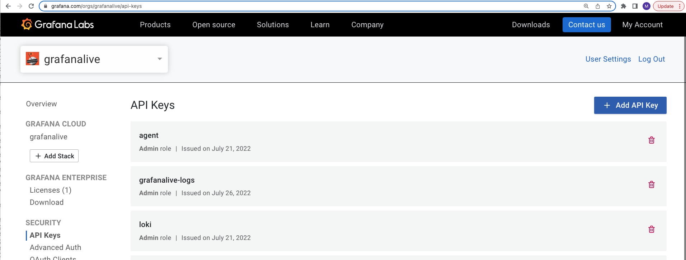
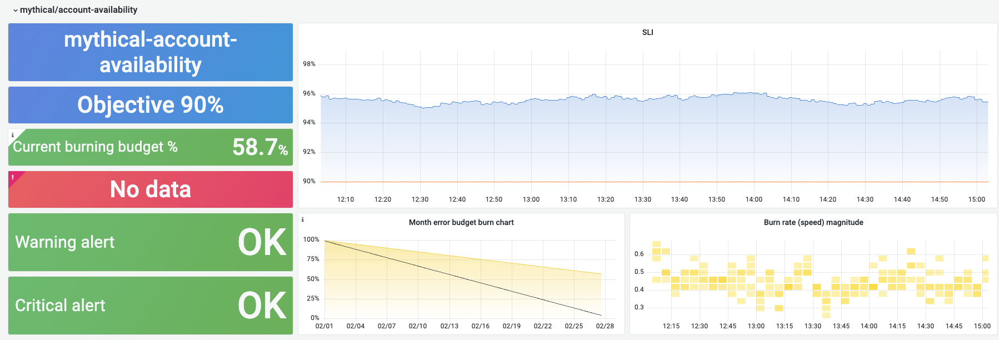
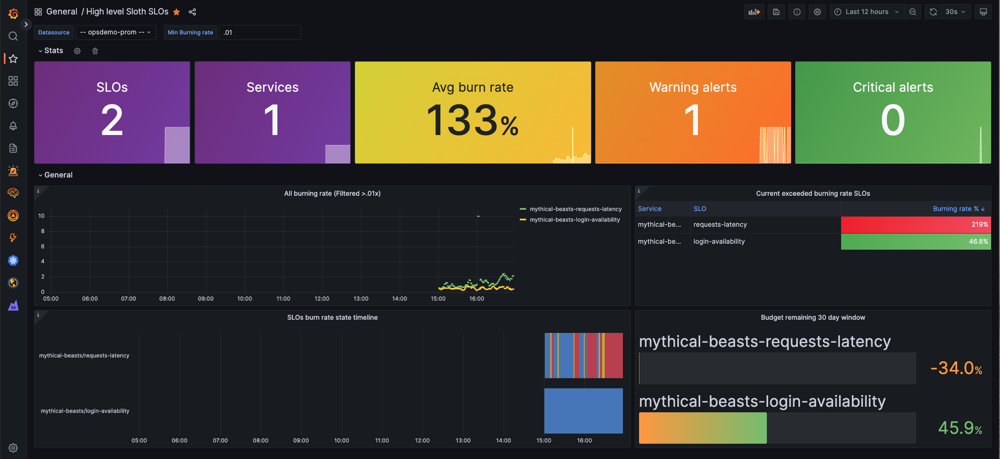

# Breakout - Create and Import Multi-Window, Multi-Burn Rate Alerts, Recording Rules, and Dashboards into Grafana Cloud

## Pre-requisites

* Linux shell knowledge
* vim or Nano/Pico editor knowledge
* Access to the WebShell via the link you received in your workshop email
  * Note: Username and password should have been pre-supplied

This workshop includes the editing of files in the WebTerminal you have been given login details for. Both vim and pico have been included in the webterminal to allow you to carry out this editing. All of the examples in this breakout use `pico`, as it’s a simple to use editor, but feel free to use `vim` if you’re familiar with it.

The Pico editor can be navigated using your keyboard cursor keys (as well as Page-Up and Page-Down to move pages), as well as some specific `Ctrl` key based shortcuts:

* Paste: **Ctrl-V**
* Save file: **Ctrl-O**
* Quit: **Ctrl-X**
* Cancel: **Ctrl-C**

## Breakout
We have just instrumented our cutting-edge critical business application, Mythical Beasts, and now would like to use SLOs to help the organization decide on whether to innovate faster and develop new Mythical Beasts features, or work on Service Stability and Performance optimization.

Since we already have rolled out the application to early access customers, we are tracking application performance, errors, and overall load in the `Mythical Inc., Top Level Endpoints RED (MLT)` dashboard in our Grafana instance.

1. Log into your Grafana instance by going to the Grafana website using URL, login and password credentials you were sent.

1. In your Grafana UI, click on the magnifying glass to search for the dashboard mentioned above. Type in `myth`. Click on the dashboard name to open the dashboard.

   
   

2. Analyze your dashboard. This is considered a "RED" dashboard as it has three distinct sections of data: Request rates(R) in the top left, errors(E) in the top right, and duration(D) or latency metrics in the center.  Since this is a new service, you will likely notice that the error rate percentages are quite elevated. So, our SLOs are going to focus on error rates per endpoint first.


1. If you'd like to get a sense of what types of errors the application is experiencing, you can drill into the endpoint's transaction details by clicking on the graph for the endpoint target.

   a. For example, if you were to click on the endpoint `/login` in the upper right graph, a new tab with Grafana's "Explore" feature will appear. You will see that your Distributed tracing instance data source has been pre-populated in the top dropdown, and the "TraceQL" (Tempo's distributed tracing query language) field has been pre-populated with the name of your endpoint (/login) as the `.http.target` value, and the `status` field has been set to `error`.
    

   b. Click on one of the distributed Trace IDs. This will add a second pane to your existing window with that trace's full transaction path, and shows you not only the sequence and durations of each span within the trace, but also provides span details such as tags, process metadata, and trace logs(if any were recorded).

   c. Since we are filtered on errored transactions, you will notice that one or more of the spans within your trace has a red exclamation mark next to it, signifying an errored span.  Click on that particular span and then click on `Attributes`.  While your particular error status message may be different, I have a `db.statement` field referencing a postgresql query.  I also see an attribute called `status.message` that is associated with our errored status.code. I have a "null value" error, signifying there is a problem with our postgresql query.


If you would like more details concerning the features of Grafana's tracing visualization in Explore, go here: https://grafana.com/docs/grafana/latest/explore/trace-integration/

### Create SLO files based on existing examples from Sloth

1. Start by logging into the webterminal with your username and password. This will log you into a home directory in a Debian Linux shell where we’ll edit some files and deploy an application to a k8s cluster.

   Your home directory includes a few things:

   * A `sloth` directory containing its executable and a example file.  This was created on your behalf by copying the relevant files from the Sloth repo at [`https://github.com/slok/sloth.git`](https://github.com/slok/sloth.git); downloading the sloth executable from [here](https://github.com/slok/sloth/releases/tag/v0.11.0), and then performing a `chmod +x` to the executable file and renaming the file to `sloth`.
   * A `mimirtool` binary. We downloaded Mimirtool from the Assets section of [Mimir's latest release page](https://github.com/grafana/mimir/releases). Mimir documentation can be found [here](https://grafana.com/docs/mimir/latest/operators-guide/tools/mimirtool/).

   As mentioned in the workshop presentation, we will use Sloth to create the SLO yaml definitions file, and then we will use Mimirtool to import those rules within the SLO definitions file.

   * We will also need to get an API key in order for Mimirtool to authenticate with Grafana Cloud.
   * Finally, we will import an SLO dashboard provided by Sloth to track our SLOs visually.

   We’re going to first modify Sloth's "Getting Started" file for a single SLO on a single application endpoint, and see them in Grafana Cloud.

1. In the WebShell, run:
   ```bash
   cp ./sloth/examples/getting-started.yml ./sloth/examples/mythical.yml
   pico ./sloth/examples/mythical.yml
   ```

1. In this source file, we need to edit many of the definitions.

   a. **version**: `prometheus/v1` -> We will keep this definition as our application metrics are Prometheus-based.

   b. **service**: `myservice` -> Let's change this value to our service name, `mythical-beasts`

   c. **labels**: `owner`, `repo`, and `tier`.  These labels are added to our recording rules.
      - For now, let's delete the `repo` line.
      - Keep the line with `tier` as-is (as mythical beasts is a tier 2 application).
      - Change the value of `owner` from `myteam` to your first initial and last name.
      - Add a new label-value pair called `type: "slo"`(horizontally indented the same as your existing labels).  This will allow us to find our SLO definitions in production more easily in the Grafana Alerting UI.

   d. Next are the **slos**.  Like with this example, we are going to stick with just one SLO - a request/error rate SLO - but our SLO target is going to be much lower.
      - Change the comment from `We allow failing (5xx and 429) 1 request every 1000 requests (99.9%).` to: `We allow failing (5xx and 429) 1 of every 20 requests (95%).`.
      - Since this SLO will be for the login endpoint only, change the name from "requests-availability" to `login-availability`
      - Change the objective from 99.9 to `95.0`.
      - Keep the **description** as-is.  This description does not generate any output.

1. We now get to the two **sli** values driving the SLO.  Sloth is a ratio-based SLO tool, and we need to define two SLIs: (1) our error count and (2) our total count.  The ratio of these two SLIs is our error or failure rate.

   a. The formula of `sum(rate(http_request_duration_seconds_count{job="myservice",code=~"(5..|429)"}[{{.window}}]))` is not correct for our application. To understand the formula we need, we need to look at how we are capturing the error percentages today.
   - Go back to our dashboard and click on the top of the panel named, `Error Percentages by Target` and then click `Edit`.
      
   - You will see this crazy formula.  It is a ratio of errored traces versus total traces by http_target/endpoint.  However, we want SLOs for each endpoint separately.

      `(sum by (http_target)(increase(traces_spanmetrics_calls_total{status_code="STATUS_CODE_ERROR",http_target=~"\\/account|\\/health|\\/cart|\\/fastcache|\\/login|\\/payment"}[1m]))) /
(sum by (http_target)(increase(traces_spanmetrics_calls_total{status_code!="",http_target!="\\/account|\\/health|\\/cart|\\/fastcache|\\/login|\\/payment"}[1m]))) * 100`

      

   b. Let's focus on the `/login` http_target first. Go back to the tab with the WebShell in it, and copy and paste this formula into the **error_query** field:

      ```
      sum by (http_target)(increase(traces_spanmetrics_calls_total{service_name="mythical-server",http_target=~"/login", status_code="STATUS_CODE_ERROR"}[{{.window}}]))
      ```

   - If you are curious, we leave the `sum by http_target` in the formula because we have multiple pods supporting the application, and so those metrics need to be aggregated.
   - We also use a `[{{.window}}]` notation for the time range because it is a variable in Sloth. Sloth fills this value in for each of the recording rules it creates for each of our time windows: 5m, 30m, 1h, 2h, 6h, 1d, 3d, 30d.

   c. Copy and paste this formula into the **total_query** field. Notice the only difference between this formula and the error_query formula is the status_code NOT(!) empty:

      ```
      sum by (http_target)(increase(traces_spanmetrics_calls_total{service_name="mythical-server",http_target=~"/login", status_code!=""}[{{.window}}]))
      ```

1. Now that our SLIs are defined, we need two minor edits to our alerting section:

    a. Change the alerting **name** to ```MythicalBeastsHighErrorRate-login```

    b. For alerting labels, keep the existing `category: "availability"` key value pair.  Add a new label-value pair called `type: "slo"` (horizontally in line with your existing label).  This will allow us to find our SLO definitions in production more easily in the Grafana Alerting UI.

    c. Change the alert annotations **summary** from `"High error rate on 'myservice' requests responses"` to `"High error rate on Mythical Beast login request responses"`

    d. Delete the last 8 lines (a 4-line `page_alert` block and a 4-line `ticket_alert` block). This allows you to set custom tags for "page" versus "ticket" types of alerts as mentioned in the presentation.  You will see that page versus ticket alert types are automatically defined and appropriately tagged with the label, `sloth_severity`, without adding extra labels to our definition.

1. Finally, save the code you’ve just added by typing **Ctrl-O** and then quit Pico with **Ctrl-X**. If you don’t save, you’ll be first asked if you want to save the file if you just hit **Ctrl-X**.

7. We are now ready to run Sloth.  From command line, run the following command:
    ```bash
    ./sloth/sloth generate -i ./sloth/examples/mythical.yml > ./mythical-beasts-SLO-rules.yml
    ```

Assuming you have no errors, your output file (`mythical-beasts-SLO-rules.yml`) will look similar to the structure (but not content) found in Sloth's online documentation [here](https://sloth.dev/examples/default/getting-started/) (click on the "Generated" tab).

We can now import your SLO rules into Grafana Cloud!  But first, we need to download an API key for data transmission.

### Import SLO Alerts and Recording rules into Grafana Cloud

* To download an API key, you would normally log in as an administrator of your Grafana Cloud account at `https://grafana.com/orgs/<your organization>/api-keys` and click on **+ Add API Keys**.  However, this is a custom cloud account not affiliated with Grafana Cloud, and so we provided you a script called `get-credentials.sh` to download the API key instead.
  

1. Run the `get-credentials.sh` script:
      ```bash
      ./get-credentials.sh
      ```
      This will give you three fields with associated values:
      * `slug` - The slugname
      * `tenantId` - The metrics tenant ID for Grafana Cloud
      * `apiKey` - The API key to use with Grafana Cloud

2. Using your slo rules file, your mimirtool executable, slug name, tenant ID and api key, import your SLO recording rules and alerts:
    ```bash
    ./mimirtool rules load ./mythical-beasts-SLO-rules.yml --address=<slug> --id=<tenantId> --key=<apiKey>
    ```
    Be sure to use the full value for each, including the inverted commas (`"`).

 3. Assuming there were no errors, go to your Grafana UI tab, and on the left side menu, hover over **Alerting** and then click on **Alert rules**.

    a. You should see your recording rules as well as your alerts listed.  To see your recording rules, use the "Search by label" capability by typing in `label:sloth_slo=login-availability`.  Results similar to the picture below should appear. (You may need to click the **>** next to each rule group to view all the rules.) You have two sets of recording rules:
    - `sloth-slo-meta-recordings-mythical-beasts-login-availability` - the meta recording rules
    - `sloth-slo-sli-recordings-mythical-beasts-login-availability` - the SLI/SLO recording rules

    While the meta recording rules are fairly simplistic, expand the first SLI/SLO recording rule by clicking on the **>** next to it.  As you can see in the picture below, Sloth created this complex formula on your behalf.

    

    b. As for alerts generated, two multi-time window, multi-burn rate alerts are generated.  To see your alert rules, use the "Search by label" capability by typing in ```label:category=availability```.  Results similar to the picture further below should appear. Click the **>** next to the rule group to see the rules, and expand each rule to see its detail.

    One rule is for slow burns over longer periods of time, which has a tag of ```sloth_severity=ticket```. The second alert is for higher burn rates over shorter periods of time and has a tag of ```sloth_severity=page```.  These tags can be used to route your SLO alerts to say, Slack, for an SRE to investigate immediately if you are experiencing high burn rates, and then route your slow burn rate alerts to your ticketing system for scheduled analysis.

    

 ### Import an SLO dashboard into Grafana Cloud

 If we'd like to visualize this data over time and see how we are doing against our objectives, we can import a dashboard into Grafana Cloud.

Steps to Import:

1. Go to the Dashboards (4 squares) icon in the left menu and click on **+ Import**.

2. In the Import via grafana.com field, type in `14348` and then click *Load*.  For the `prometheus` data source, select `grafanacloud-<username>-prom` where `<username>` is the username for your instance, and then select "Import".
 If you were to add more SLOs for our application, the dashboard would look similar to this below.

    

__Note__: These are the out-of-box dashboards provided by Sloth [here](https://sloth.dev/introduction/dashboards/). There are two details to be aware of:
* You will see no burn rates in the top graphs if you do not enter in a value.  If you enter a burn rate of `0.01` into the field `Min Burning Rate` like is shown in the picture above, you will see all of the burn rates for your SLOs.

* You will likely see a graph that says `No Data` in one of the graphs like this (in red):

If you click on the top of the No Data panel and then click `Edit`, you will see a complicated formula that uses a time range of `32d`.  In the picture below, I have changed that SLO window to `31d`, and now you see that the data is populating correctly for this panel.  After editing your SLO window to *31d*, click on `Apply` in the top right to apply your change.


3. An overview dashboard is also available. Go to the Dashboards (4 squares) icon in the left menu and click on **+ Import**.

4. In the Import via grafana.com field, type in `14643` and then click **Load**. For the `prometheus` data source, select `grafanacloud-<username>-prom` where `<username>` is the username for your instance, and then select "Import".

An example representation is below where a second SLO has been added for effect.  The reason I find the overview valuable is that it visualizes a state timeline on your behalf for all of your services. So, you can see exactly when your burn rates were running hot.  One thing that can be adjusted on this dashboard is that while we have a datasource variable dropdown at the top of the dashboard, that variable is not propagated to its panels.  This is an easy fix, but not something that we will cover in this workshop.


At this point, if you are the type of student that likes to work at their own pace and happen to be far ahead of the current classroom pace and would like to test your Sloth configuration file skills, feel free to create additional SLOs for the other application endpoints (`/account`, `/health`, `/cart`, `/fastcache`, and `/payment`).  If you don't finish during the class, that is OK. An example configuration file to refer back to is [here](./examples/slo-config-availability-only.yml).

### Import more SLOs

Now that we understand how to (a) properly format a Sloth file; (b) use Sloth to generate our rules file; and (c) import those rules using Mimirtool, it is time to add import more SLOs to save ourselves some time as the process is repetitive.  We will now import two sets of SLOs: availability and latency-based.  We will import both

#### Generate and import the remainder of your SLOs

1. We are now ready to run Sloth.  From command line, run the following two commands:
    ```
    ./sloth/sloth generate -i ./sloth/examples/slo-config-availability-only.yml > ./SLO-availability.yml
    ./sloth/sloth generate -i ./sloth/examples/slo-config-latency.yml > ./SLO-latency.yml
    ```

    We can now import your SLO rules into Grafana Cloud.  We will re-use your API key for the import process.

2. If you do not have them already, get the relevant credentials for Grafana Cloud:
    ```bash
    ./get-credentials.sh
    ```

3. Using your two SLO rule files, your mimirtool executable, slug name, tenant ID and api key, import your SLO recording rules and alerts with the following two commands:
    ```bash
    ./mimirtool rules load ./SLO-availability.yml --address=<slug> --id=<tenantId> --key=<apiKey>
    ./mimirtool rules load ./SLO-latency.yml --address=<slug> --id=<tenantId> --key=<apiKey>
    ```
    Be sure to use the full value for each, including the inverted commas (`"`).

3. Assuming there were no errors, go to your Grafana UI browser tab, and on the left side menu, hover over **Alerting** and then click on **Alert rules**.  You should see your recording rules as well as your alerts listed.  

4.  View the dashboards and observe that the latency SLOs now appear.  To do this, in the left side menu, hover over **Dashboards** and then click on **Browse** and search for the two dashboards that were imported earlier:

    - On the **High level Sloth SLOs** dashboard, `mythical-beasts-login-latency` should appear in the SLO burn rate timeline and the Budget remaining 30 day window.
    - On the **SLO / Detail** dashboard, you should see a row of panels for `mythical-beasts/login-latency`.

**[END OF HANDS-ON PORTION OF THE WORKSHOP]**

## Summary

In this workshop, you learned how to:

- Define SLO (Service Level Objectives) for an application in code by writing a [Sloth][sloth] configuration file.

- Write an SLI for an application based on its availability (ratio of failed requests).

- Use Sloth to generate recording rules for Mimir, and import the rules into Grafana Cloud using `mimirtool`.

- View your SLIs on dashboards in Grafana.

[sloth]: https://sloth.dev/

